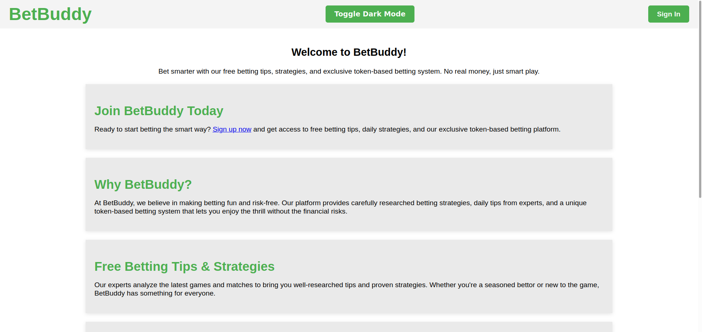
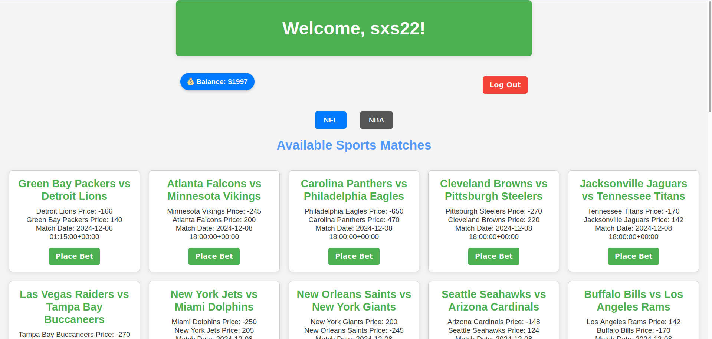
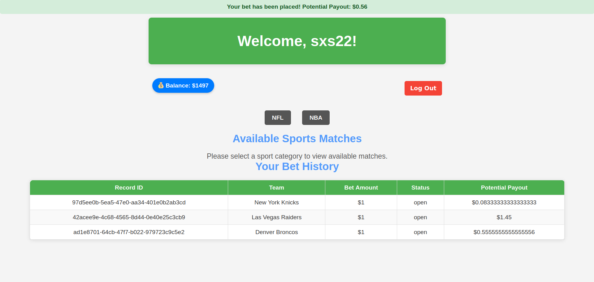

# BetBuddy

A free to play sports gambling app where users can place bets using virtual currency


## Screenshots:

Example screenshots for what to expect from this repository







## Installation:
**To download the repository with `git`**
1. Open your terminal
2. Perform the following commands
```bash
git clone https://github.com/KPCOFGS/BetBuddy.git
cd BetBuddy
```
3. Download necessary dependencies using the following command
```bash
python -m pip install -r requirements.txt
```
4. Run the script
```bash
python app.py
```
**To download the repository without `git`, please follow the instructions below:**


1. Find the `Code` Button:
   - Once you're on the repository page, look for and click a green button that says **Code**. This button is usually located above the repository files, on the right side.

2. Download as ZIP:
   - In the dropdown menu, you will see several options. Click on **Download ZIP**.

3. Save the ZIP File:
   - Your browser will start downloading the ZIP file.
   - Choose a location on your computer to save the file (like the Downloads folder) if prompted.

4. Extract the ZIP File:
   - Once the download is complete, navigate to the location where you saved the ZIP file.
   - Right-click on the ZIP file and select **Extract All** (or a similar option depending on your operating system) to unpack the files.

5. Access the Repository Files:
   - After extracting, you will have a folder containing all the files from the repository. You can now navigate through the files as needed.
## Use Your Own API

**This repository uses The Odd API. To use your own The Odd API, follow the steps below:**
1. Navigate to [The Odd API official website](https://the-odds-api.com/)
2. Click the blue button that shows `Get API Key ->`
3. Click the blue `Start` button under `FREE` subscription
4. Fill the blank for `First Name` and `Email`, and do the CAPTCHA
5. Click `Subscribe`
6. Check your email for the API key
7. Lastly, replace your API key with the one in `API.txt` file

## Helper Scripts

* Two helper scripts are provided in this repository: [print_table.py](print_table.py) and [test_bet.py](test_bet.py)
* `print_table.py` prints tables in the database. It includes useful information such as game ID of completed games, games that users placed bets on, future games, etc...
* `test_bet.py` tests the bet functions to ensure it works properly. It takes in a parameter `<game ID>`, which will inject a bet of the corresponding game to the **first user** registered in the database.
* `test_bet.py` is useful when injecting a non-existent game ID to test if the system will detect it and remove it. Or injecting a completed game ID, test the reward system and remove the completed game from user's data table since it is no longer useful and relevant.
## Documentation
* For Software Requirements, Progress Report or any other documents, please visit [docs](docs/) folder
## License

This repository is license under the Unlicense, see [LICENSE](LICENSE) for more detail.
